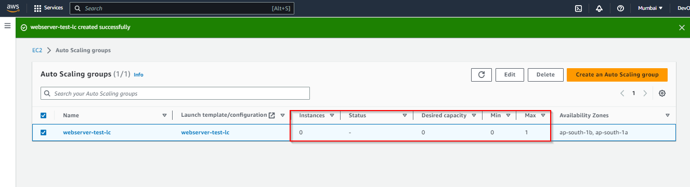

# Add an existing EC2 instance to an Auto Scaling group(ASG)

An Auto Scaling Group contains multiple EC2 instances that is used to ensure the reliability and scalability of the applications. 

In normal scenarios, the EC2 instances will be created automatically when an ASG is created. However, there can be scenarios where an existing EC2 instance needs to be added to an Auto Scaling Group. This blog helps you to achieve this.

The following steps has to be followed to add an existing EC2 instace to an autoscaling group.

## Create the AMI of the existing instance.
Navigate to:
* **Instances**
* **Select the Instance**
* Choose **Actions**
* Choose **Image and Templates**
* Choose **Create Image**


 
## Create a Launch Configuration
From the AWS Management Console:
* Choose **Auto Scaling Group**
* Choose **Launch Configuration**

Create the Launch Configuration using the previously created AMI of the instance. This AMI will be present under the **MyAMI** option while creating the Launch Configuration.


 
## Create the Auto Scaling Group
* Goto **Auto Scaling**
* Choose **Auto Scaling Groups**
* Create Auto Scaling Group.

Here, we are using Launch Configuration to create the Auto Scaling Group. So, click on the ```Switch to Launch Configiration``` option and choose the lauch configuration we have created.

 
  
Choose the VPC and the required Availability Zones and subnets. We are using default VPC here. ```Make sure that the VPC and the Availability Zone are the same as that of the instance which is to be added in the Auto Scaling Group```.

An important section in this configuration is the
```Group size``` option ```Configure group size``` and ```scaling policies``` section.

### **Desired capacity**
Desired capacity represents the initial capacity of the Auto Scaling group at the time of creation. An Auto Scaling group attempts to maintain the desired capacity. It starts by launching the number of instances that are specified for the desired capacity, and maintains this number of instances as long as there are no scaling policies or scheduled actions attached to the Auto Scaling group.
### **Minimum capacity**
Minimum capacity represents the minimum group size. When scaling policies are set, an Auto Scaling group cannot decrease its desired capacity lower than the minimum size limit.
### **Maximum capacity**
Maximum capacity represents the maximum group size. When scaling policies are set, an Auto Scaling group cannot increase its desired capacity higher than the maximum size limit.

In our case, we set the following values for the Group size:

```Desired capacity: 0```

```Minimum capacity: 0```

```Maximum capacity : 1```

>Setting this value will create an Auto Scaling Group without any instances in it.



Now we can go ahead and add the existing EC2 instance to the Auto Scaling Group. For this,
* Go to **Instances**
* **Select the instance**
* Choose **Actions**
* Choose **Instance Settings**
* Select the **Attach to Auto Scaling group** option
* Select the Auto Scaling group we have created.

Once this is done, the EC2 instance will be a part of the ASG. Now, the value of Desired capacity of the ASG is 1 since an instance has been added to it. 
 
You can see the details of the Auto Scaling Group and the instances from by going to the ASG.


The detailed logs regarding the activities of the ASG can be found from the Activity Tab

